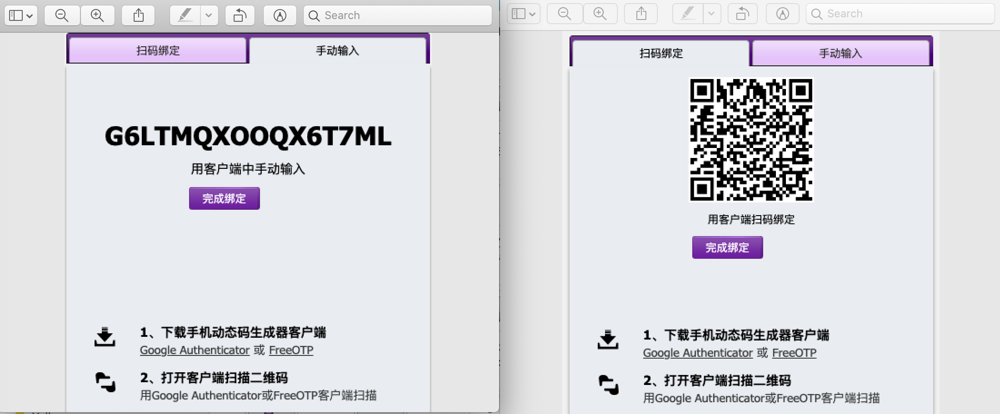

##登录脚本使用帮助文档

#### 一、功能说明

 - 使用该登录脚本可自动获取谷歌动态验证码登录跳板机

#### 二、目录结构

```

----  login-lib    |
    |-- README.md          #使用帮助文档
    |
    |-- login.sh           #主登录脚本
    |
    |-- core_login.sh      #核心expect登录脚本
    |
    |-- google_auth.py     #基础版谷歌验证码获取脚本
    |
    |-- google_auth.py_bak #基于pyotp的谷歌验证码获取脚本
    |
    |-- docs               #文档
    |
    |-- imgs               #图片素材
    |
    |-- test_core_login.sh #验证核心登录的脚本
    |
    |-- demo_notoken.sh    #测试环境无验证码使用示例
    |
    |-- demo_token.sh      #生产环境带动态验证码使用示例
    |
    
```


#### 三、准备与安装

##### 3.1 安装expect(以Mac为例)

###### 3.1.1 **mac 安装brew**

```
/usr/bin/ruby -e "$(curl -fsSL https://raw.githubusercontent.com/Homebrew/install/master/install)"
```

 

###### 3.1.2 **mac安装expect(需要先安装brew，没有安装的话看上边)**

```
brew install expect
```

 ##### 3.2 安装Python相关

一般系统都自带Python 2.7和Python3，若没有的话自行谷歌或百度

###### 3.2.1 **安装pyotp(可选，默认不使用)**

[pyotp安装](https://github.com/pyauth/pyotp)

##### 3.3 获取谷歌验证码秘钥
一般在初次配置VPN的时候会自动生成或者系统管理员会给你（**若没有的话可以找管理员重置，重新获取绑定就好了，这次记得存根哦**）。如：



**友情提示:** 用支付宝扫描二维码可以看到秘钥字串,赶快试一试吧

#### 四、使用示例

###### 4.1 **使用说明**

请参考 **demo_notoken.sh** 和 **demo_token.sh**，脚本中已经有较详细的说明了，一看就懂^_^

**注意**:若需要动态验证码，则将secret替换为自己的动态验证码秘钥，若不需要则设置为空串

###### 4.1.1 **基础用法:**

- 复制一份demo_token.sh并命名，如some-app-login.sh
- 修改host、port、user、passwd、secret为你自己的(也可以自己扩展从文件读取)
- 执行脚本./some-app-login.sh
- 登录成功

###### 4.1.2 **高级用法**

- 声明全局的环境变量LOGIN_LIB_PATH
- 将自定义脚本放入一个目录，并添加到$PATH环境变量中

